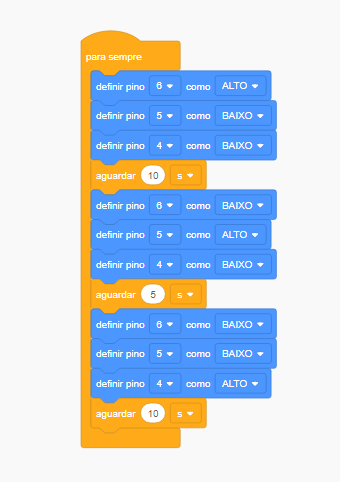

# Circuito-Semaforo
Circuito  simples que simula um semáforo utilizando  um arduino 

Este circuito foi feito no tinkercad utilizando os seguintes componentes: 

O circuito foi criado conforme a imagem abaixo:
 

Utilizando a programação em blocos, o código ficou assim: 
